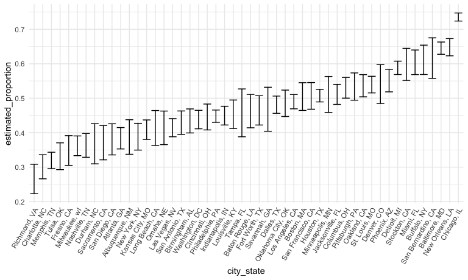

Solutions for Homework 5
================
Jiajun Tao
2022-11-05

### Problem 1

Our goal is to create a tidy dataframe containing data from all
participants, including the subject ID, arm, and observations over time.

We first created a dataframe containing all file names using
`list.files` function. Then we added the relative path to the file names
in order to be used in `read_csv` function. We iterated over file names
and read in data for each subject using `map` and saving the result as a
new variable in the dataframe. After that we unnested the data and do
some cleaning. We added variables including arm, subject ID, and made
the week as a variable using `pivot_longer`.

``` r
files_df = tibble(
  files_name = list.files("data/problem_1/")) %>% 
  mutate(
    files_path = str_c("data/problem_1/",files_name),
    data = map(files_path, read_csv)
  ) %>% 
  unnest(data) %>% 
  select(-files_path) %>% 
  mutate(
    files_name = str_remove(files_name,".csv")
  ) %>% 
  separate(files_name, into = c("arm", "subject_id"), sep = "_") %>% 
  pivot_longer(
    week_1:week_8,
    names_to = "week",
    values_to = "observations",
    names_prefix = "week_"
  )

files_df
```

    ## # A tibble: 160 × 4
    ##    arm   subject_id week  observations
    ##    <chr> <chr>      <chr>        <dbl>
    ##  1 con   01         1             0.2 
    ##  2 con   01         2            -1.31
    ##  3 con   01         3             0.66
    ##  4 con   01         4             1.96
    ##  5 con   01         5             0.23
    ##  6 con   01         6             1.09
    ##  7 con   01         7             0.05
    ##  8 con   01         8             1.94
    ##  9 con   02         1             1.13
    ## 10 con   02         2            -0.88
    ## # … with 150 more rows

``` r
files_df %>% 
  ggplot(aes(x = week, y = observations)) +
  geom_line() +
  facet_grid(. ~ arm)
```


We made a spaghetti plot showing observations on each subject over time.
As we can see in the plot, the observations are obviously higher in the
experimental arm than in the control arm for each week. What’s more, in
the control arm, the observations seem to be at the same level over
time, but in the experimental arm, the observations increase as time
goes by.

### Problem 2

First, we import the data.

``` r
homicides_df = read_csv("data/problem_2/homicide-data.csv") 
```

The raw data has 52179 rows and 12 columns. The variables include uid,
reported_date, victim_last, victim_first, victim_race, victim_age,
victim_sex, city, state, lat, lon, disposition.

Then we created a `city_state` variable and summarized within cities to
obtain the total number of homicides and the number of unsolved
homicides.

``` r
homicides_df = 
  homicides_df %>% 
  mutate(
    state = ifelse(city == "Tulsa",
                   "OK",
                   state),
    city_state = str_c(city, ", ", state)
  )

n_homicides = 
  homicides_df %>% 
  group_by(city_state) %>% 
  summarise(
    n_total_homicides = n()
  )

n_homicides
```

    ## # A tibble: 50 × 2
    ##    city_state      n_total_homicides
    ##    <chr>                       <int>
    ##  1 Albuquerque, NM               378
    ##  2 Atlanta, GA                   973
    ##  3 Baltimore, MD                2827
    ##  4 Baton Rouge, LA               424
    ##  5 Birmingham, AL                800
    ##  6 Boston, MA                    614
    ##  7 Buffalo, NY                   521
    ##  8 Charlotte, NC                 687
    ##  9 Chicago, IL                  5535
    ## 10 Cincinnati, OH                694
    ## # … with 40 more rows

``` r
n_unsolved = 
  homicides_df %>% 
  filter(disposition %in% c("Closed without arrest", "Open/No arrest")) %>% 
  group_by(city_state) %>% 
  summarise(
    n_unsolved_homicides = n()
  )

n_unsolved
```

    ## # A tibble: 50 × 2
    ##    city_state      n_unsolved_homicides
    ##    <chr>                          <int>
    ##  1 Albuquerque, NM                  146
    ##  2 Atlanta, GA                      373
    ##  3 Baltimore, MD                   1825
    ##  4 Baton Rouge, LA                  196
    ##  5 Birmingham, AL                   347
    ##  6 Boston, MA                       310
    ##  7 Buffalo, NY                      319
    ##  8 Charlotte, NC                    206
    ##  9 Chicago, IL                     4073
    ## 10 Cincinnati, OH                   309
    ## # … with 40 more rows

``` r
n_df = left_join(n_homicides,n_unsolved)
```

``` r
baltimore_df =
  n_df %>% 
  filter(city_state == "Baltimore, MD")

output_p_test = 
  prop.test(x = baltimore_df$n_unsolved_homicides, n = baltimore_df$n_total_homicides) %>% 
  broom::tidy()
```

``` r
n_df %>% 
  mutate(
    output_p_test = map2(.x = n_unsolved_homicides, .y = n_total_homicides, ~broom::tidy(prop.test(x = .x, n = .y)))
  ) %>% 
  unnest(output_p_test) %>% 
  rename(estimated_proportion = estimate) %>% 
  select(city_state, n_total_homicides, n_unsolved_homicides, estimated_proportion, conf.low, conf.high) %>% 
  mutate(
    city_state = fct_reorder(city_state, estimated_proportion)
  ) %>% 
  ggplot(aes(x = city_state, y = estimated_proportion)) +
  geom_errorbar(aes(ymin = conf.low, ymax = conf.high)) +
  theme(axis.text.x = element_text(angle = 60, hjust = 1))
```


