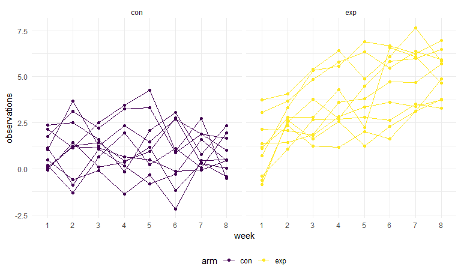
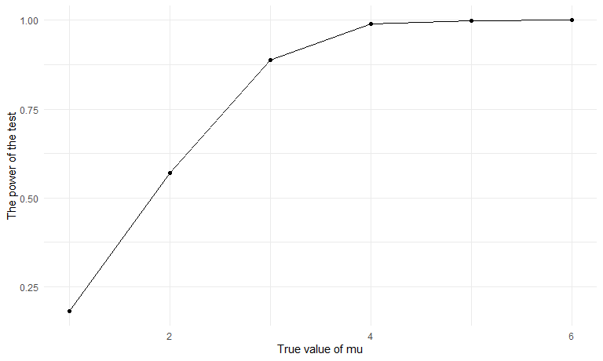

Solutions for Homework 5
================
Jiajun Tao
2022-11-05

### Problem 1

Our goal is to create a tidy dataframe containing data from all
participants, including the subject ID, arm, and observations over time.

We first created a dataframe containing all file names using
`list.files` function. Then we added the relative path to the file names
in order to be used in `read_csv` function. We iterated over file names
and read in data for each subject using `map` and saving the result as a
new variable in the dataframe. After that we unnested the data and do
some cleaning. We added variables including arm, subject ID, and made
the week as a variable using `pivot_longer`.

``` r
files_df = tibble(
  files_name = list.files("data/problem_1/")) %>% 
  mutate(
    files_path = str_c("data/problem_1/",files_name),
    data = map(files_path, read_csv)
  ) %>% 
  unnest(data) %>% 
  select(-files_path) %>% 
  mutate(
    files_name = str_remove(files_name,".csv")
  ) %>% 
  separate(files_name, into = c("arm", "subject_id"), sep = "_") %>% 
  pivot_longer(
    week_1:week_8,
    names_to = "week",
    values_to = "observations",
    names_prefix = "week_"
  )

files_df
```

    ## # A tibble: 160 × 4
    ##    arm   subject_id week  observations
    ##    <chr> <chr>      <chr>        <dbl>
    ##  1 con   01         1             0.2 
    ##  2 con   01         2            -1.31
    ##  3 con   01         3             0.66
    ##  4 con   01         4             1.96
    ##  5 con   01         5             0.23
    ##  6 con   01         6             1.09
    ##  7 con   01         7             0.05
    ##  8 con   01         8             1.94
    ##  9 con   02         1             1.13
    ## 10 con   02         2            -0.88
    ## # … with 150 more rows

``` r
files_df %>% 
  ggplot(aes(x = week, y = observations, group = subject_id, color = arm)) +
  geom_point() +
  geom_path() +
  facet_grid(. ~ arm)
```



We made a spaghetti plot showing observations on each subject over time.
As we can see in the plot, the observations are obviously higher in the
experimental arm than in the control arm. What’s more, in the control
arm, the observations seem to be at the same level over time, but in the
experimental arm, the observations increase as time goes by.

### Problem 2

First, we imported the data.

``` r
homicides_df = read_csv("data/problem_2/homicide-data.csv") 

homicides_df
```

    ## # A tibble: 52,179 × 12
    ##    uid   repor…¹ victi…² victi…³ victi…⁴ victi…⁵ victi…⁶ city  state   lat   lon
    ##    <chr>   <dbl> <chr>   <chr>   <chr>   <chr>   <chr>   <chr> <chr> <dbl> <dbl>
    ##  1 Alb-…  2.01e7 GARCIA  JUAN    Hispan… 78      Male    Albu… NM     35.1 -107.
    ##  2 Alb-…  2.01e7 MONTOYA CAMERON Hispan… 17      Male    Albu… NM     35.1 -107.
    ##  3 Alb-…  2.01e7 SATTER… VIVIANA White   15      Female  Albu… NM     35.1 -107.
    ##  4 Alb-…  2.01e7 MENDIO… CARLOS  Hispan… 32      Male    Albu… NM     35.1 -107.
    ##  5 Alb-…  2.01e7 MULA    VIVIAN  White   72      Female  Albu… NM     35.1 -107.
    ##  6 Alb-…  2.01e7 BOOK    GERALD… White   91      Female  Albu… NM     35.2 -107.
    ##  7 Alb-…  2.01e7 MALDON… DAVID   Hispan… 52      Male    Albu… NM     35.1 -107.
    ##  8 Alb-…  2.01e7 MALDON… CONNIE  Hispan… 52      Female  Albu… NM     35.1 -107.
    ##  9 Alb-…  2.01e7 MARTIN… GUSTAVO White   56      Male    Albu… NM     35.1 -107.
    ## 10 Alb-…  2.01e7 HERRERA ISRAEL  Hispan… 43      Male    Albu… NM     35.1 -107.
    ## # … with 52,169 more rows, 1 more variable: disposition <chr>, and abbreviated
    ## #   variable names ¹​reported_date, ²​victim_last, ³​victim_first, ⁴​victim_race,
    ## #   ⁵​victim_age, ⁶​victim_sex

The raw data has 52179 rows and 12 columns. The variables include uid,
reported_date, victim_last, victim_first, victim_race, victim_age,
victim_sex, city, state, lat, lon, disposition.

Then we created a `city_state` variable and summarized within cities to
obtain the total number of homicides and the number of unsolved
homicides. I found that one observation might have a typo. The city was
Tulsa, but the state was AL. I thought it should be in OK, so I just
corrected it.

``` r
homicides_df = 
  homicides_df %>% 
  mutate(
    state = ifelse(city == "Tulsa",
                   "OK",
                   state),
    city_state = str_c(city, ", ", state)
  ) %>% 
  group_by(city_state) %>% 
  summarise(
    n_total = n(),
    n_unsolved = sum(disposition %in% c("Closed without arrest", "Open/No arrest"))
  )

homicides_df
```

    ## # A tibble: 50 × 3
    ##    city_state      n_total n_unsolved
    ##    <chr>             <int>      <int>
    ##  1 Albuquerque, NM     378        146
    ##  2 Atlanta, GA         973        373
    ##  3 Baltimore, MD      2827       1825
    ##  4 Baton Rouge, LA     424        196
    ##  5 Birmingham, AL      800        347
    ##  6 Boston, MA          614        310
    ##  7 Buffalo, NY         521        319
    ##  8 Charlotte, NC       687        206
    ##  9 Chicago, IL        5535       4073
    ## 10 Cincinnati, OH      694        309
    ## # … with 40 more rows

We used `prop.test` to estimate the proportion of homicides that are
unsolved in Baltimore, MD, and pulled the estimated proportion and
confidence intervals.

``` r
baltimore_df =
  homicides_df %>% 
  filter(city_state == "Baltimore, MD") 

output_p_test = 
  prop.test(x = baltimore_df$n_unsolved,
            n = baltimore_df$n_total)

output_p_test %>% 
  broom::tidy() %>% 
  select(estimate, conf.low, conf.high)
```

    ## # A tibble: 1 × 3
    ##   estimate conf.low conf.high
    ##      <dbl>    <dbl>     <dbl>
    ## 1    0.646    0.628     0.663

Now we ran `prop.test` for each of the cities in my dataset, and
extracted both the proportion of unsolved homicides and the confidence
interval for each.

``` r
prop_test_df = 
  homicides_df %>% 
  mutate(
    output_p_test = map2(.x = n_unsolved,
                         .y = n_total, 
                         ~broom::tidy(prop.test(x = .x, n = .y)))
  ) %>% 
  unnest(output_p_test) %>% 
  rename(estimated_proportion = estimate) %>% 
  select(city_state, estimated_proportion, conf.low, conf.high)

prop_test_df
```

    ## # A tibble: 50 × 4
    ##    city_state      estimated_proportion conf.low conf.high
    ##    <chr>                          <dbl>    <dbl>     <dbl>
    ##  1 Albuquerque, NM                0.386    0.337     0.438
    ##  2 Atlanta, GA                    0.383    0.353     0.415
    ##  3 Baltimore, MD                  0.646    0.628     0.663
    ##  4 Baton Rouge, LA                0.462    0.414     0.511
    ##  5 Birmingham, AL                 0.434    0.399     0.469
    ##  6 Boston, MA                     0.505    0.465     0.545
    ##  7 Buffalo, NY                    0.612    0.569     0.654
    ##  8 Charlotte, NC                  0.300    0.266     0.336
    ##  9 Chicago, IL                    0.736    0.724     0.747
    ## 10 Cincinnati, OH                 0.445    0.408     0.483
    ## # … with 40 more rows

Finally we created a plot to show the estimates and CIs for each city in
order.

``` r
prop_test_df %>% 
  mutate(
    city_state = fct_reorder(city_state, estimated_proportion)
  ) %>% 
  ggplot(aes(x = city_state, y = estimated_proportion)) +
  geom_errorbar(aes(ymin = conf.low, ymax = conf.high)) +
  theme(axis.text.x = element_text(angle = 60, hjust = 1))
```


### Problem 3

We write a function to do simulation.

``` r
set.seed(1234)
sim_t_test = function(n = 30, mu, sigma = 5) {
    
  sample = rnorm(n = n, mean = mu, sd = sigma)
  
  test_results = t.test(sample)
  
  test_results %>% 
    broom::tidy()
}
```

Set μ=0. Generate 5000 datasets from the model.

``` r
results_df = 
  expand.grid(
    mu = 0,
    iter = 1:5000
  ) %>% 
  mutate(
    test_result = map(.x = mu, ~ sim_t_test(mu = .x))
  ) %>% 
  unnest(test_result) %>% 
  select(mu, estimate, p.value)

results_df
```

    ## # A tibble: 5,000 × 3
    ##       mu estimate p.value
    ##    <dbl>    <dbl>   <dbl>
    ##  1     0   -1.48  0.0826 
    ##  2     0   -2.76  0.00376
    ##  3     0    0.693 0.445  
    ##  4     0    0.558 0.456  
    ##  5     0    0.543 0.553  
    ##  6     0    0.632 0.523  
    ##  7     0    0.724 0.518  
    ##  8     0    0.361 0.729  
    ##  9     0    0.615 0.403  
    ## 10     0    0.765 0.410  
    ## # … with 4,990 more rows

Repeat the above for μ={1,2,3,4,5,6}

``` r
sim_df = 
  expand.grid(
    mu = 1:6,
    iter = 1:5000
  ) %>% 
  mutate(
    test_result = map(.x = mu, ~ sim_t_test(mu = .x))
  ) %>% 
  unnest(test_result) %>% 
  select(mu, estimate, p.value)

sim_df
```

    ## # A tibble: 30,000 × 3
    ##       mu estimate      p.value
    ##    <int>    <dbl>        <dbl>
    ##  1     1     1.95 0.0724      
    ##  2     2     3.04 0.00290     
    ##  3     3     3.01 0.00363     
    ##  4     4     5.69 0.00000485  
    ##  5     5     5.10 0.00000121  
    ##  6     6     5.79 0.0000000114
    ##  7     1    -1.37 0.145       
    ##  8     2     2.63 0.0271      
    ##  9     3     2.88 0.00380     
    ## 10     4     5.61 0.000000211 
    ## # … with 29,990 more rows

Make a plot showing the proportion of times the null was rejected (the
power of the test) on the y axis and the true value of μ on the x axis.

``` r
sim_df %>% 
  group_by(mu) %>% 
  summarise(
    proportion = sum(p.value < 0.05) / n()
  ) %>% 
  ggplot(aes(x = mu, y = proportion)) + 
  geom_point() +
  geom_path() +
  labs(x = "True value of mu", y = "The power of the test")
```



The power of the test increases as the effect size increases, and the
slope or the increasing rate is getting smaller as the effect size
increases.

Make a plot showing the average estimate of μ_hat on the y axis and the
true value of μ on the x axis. Make a second plot the average estimate
of μ_hat only in samples for which the null was rejected on the y axis
and the true value of μ on the x axis.

``` r
plot_1 = 
  sim_df %>% 
  group_by(mu) %>% 
  summarise(
    average = mean(estimate)
  ) %>% 
  ggplot(aes(x = mu, y = average)) + 
  geom_point() + 
  geom_path() +
  labs(x = "True value of mu", y = "Average estimate of mu hat")

plot_2 =
  sim_df %>% 
  filter(p.value < 0.05) %>% 
  group_by(mu) %>% 
  summarise(
    average = mean(estimate)
  ) %>% 
  ggplot(aes(x = mu, y = average)) + 
  geom_point() + 
  geom_path() +
  labs(x = "True value of mu", y = "Average estimate of mu hat when the null is rejected")

plot_1 + plot_2
```


When the effect size is small, the sample average of mu hat when the
null is rejected is very different from the true value of mu, actually
it’s always larger than the true value of mu. However, when the effect
size gets larger, the sample average of mu hat when the null is rejected
is approximately equal to the true value of mu. That’s because as the
power is increasing.

So given the small sample size and low power, and given that the null is
rejected, we can see the average is very different from the true mean.
It indicates the publication bias. We should be careful of this
situation. When the power is low, the sample size is small, the results
that the null is rejected may be far away from the truth.
